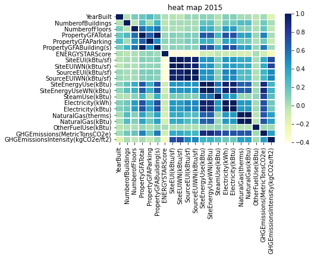
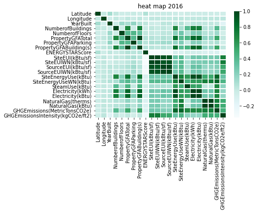
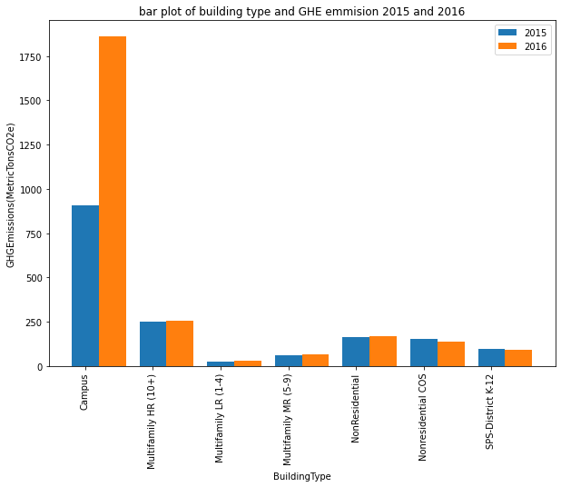
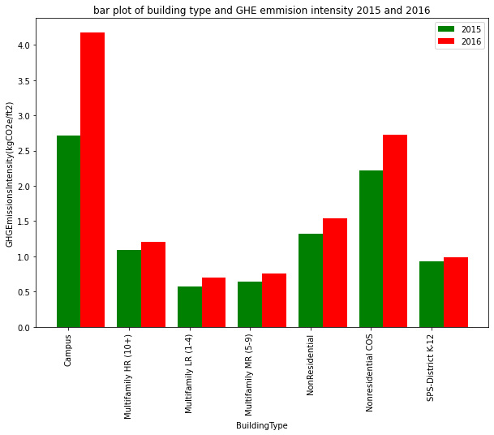

# Predict the power consumption of a building
Values Skills: Data pre-processing, descriptive statistics, Python

Skills: Regression methods, Prediction methods.
[web link](https://tejas-python.github.io/Seattle-data-analysis/)

# TASK

## You work for the city of Seattle. To achieve its goal of a carbon-neutral city in 2050, your team is taking a close interest in emissions from non-residential buildings. For this, careful records were made by your agents in 2015 and 2016.However, these surveys are expensive to obtain, and from those already done, you want to try to predict the emissions of buildings whoseemissionshave not yet been measured.Two measures interest you: CO2 emissions and total energy consumption. You also want to evaluate the interest in the emission prediction of the ENERGYSTAR Score(which is complicated to calculate)with the approach currently used by your team.
# PART A
## EDA
# Tech 
 Google colab -To perform Data analysis.
 # Installation or  Libraries
```bash
pip intsall pandas 
pip intsall matplotlib
pip3 install folium
pip install seaborn
pip install numpy
 ```
### Importing the libraries 
 ```python
 import pandas as pd
 import matplotlib.pyplot as plt
 import seaborn as sns
 import folium 
 import numpy as np
from folium import plugins
 ```
## Heat maps for 2015 and 2016 data


##### The above image gives the heat map for 2015 


##### The above image gives the heat map for 2016

## Bar plot comparision for 2015 and 2016 with respect to building type for GHE emmision


## Bar plot comparision for 2015 and 2016 with respect to building type for GHE emmision intensity


## Plotting on the world map using location 
[World map1](https://tejas-python.github.io/Seattle-data-analysis/2015map.html)

[World map2](https://tejas-python.github.io/Seattle-data-analysis/2015heatmap.html)

[World map3](https://tejas-python.github.io/Seattle-data-analysis/2016map.html)

[World map4](https://tejas-python.github.io/Seattle-data-analysis/2016heatmap.html)

## Google colab link 
[link](https://github.com/tejas-python/Seattle-data-analysis/blob/master/seatle%20data%20analysis.ipynb)
[download](https://tejas-python.github.io/Seattle-data-analysis/seatle%20data%20analysis.ipynb)
## Links
[Data](https://www.kaggle.com/city-of-seattle/sea-building-energy-benchmarking#2015-building-energy-benchmarking.csv)
